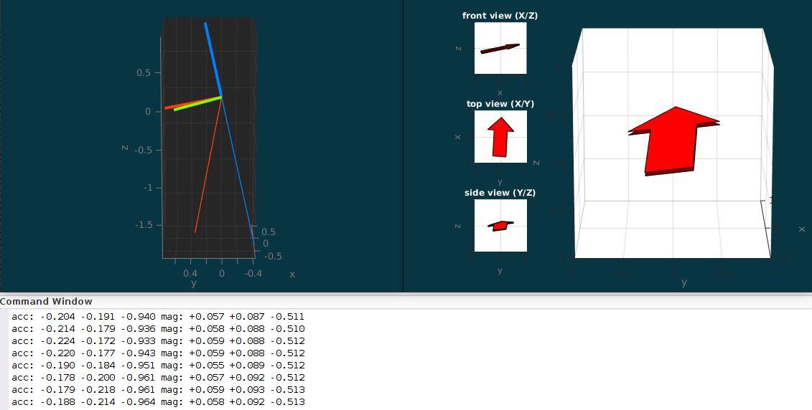
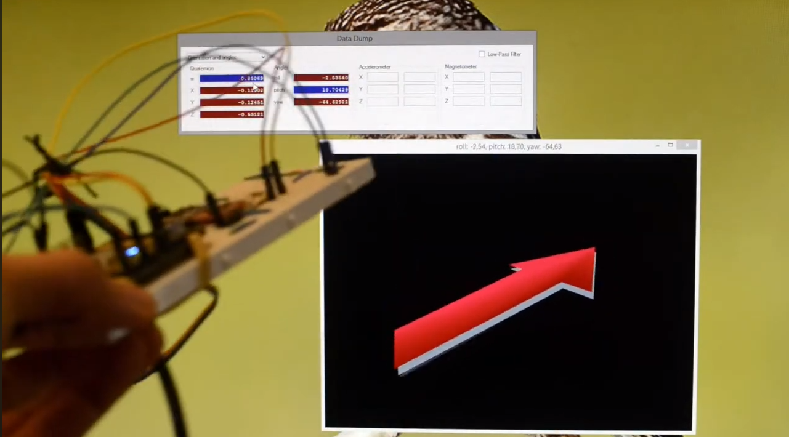

# MARG Sensor Fusion with InvenSense MPU6050 and Honeywell HMC5883L

Experiments with MEMS accelerometer, angular rate and magnetometer sensor fusion algorithms in MATLAB.

The first part around [set-1](processing/set-1/) is concerned with
direct estimation from raw data.
The second part around [set-2](processing/set-2) is concerned with
filtering the raw inputs to smoothen the estimation.

The MATLAB code was later factored into an on-device pose orientation estimation
on a Freescale FRDM-KL25Z board, the code of which can be found
in the [frdm-kl25z-marg-fusion](https://github.com/sunsided/frdm-kl25z-marg-fusion) repo.
Here, two of the eigenvectors of the direction cosine matrix are estimated directly on the device using a regular (i.e., non-extended, non-unscented) Kalman filter with TRIAD.
A video recording of the outcome can be found on YouTube:

