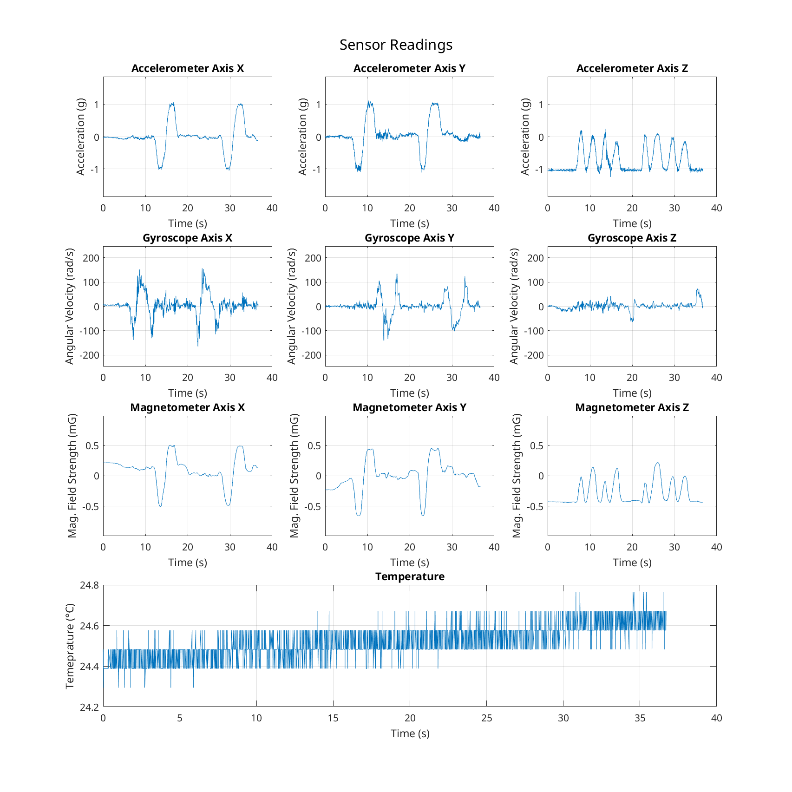
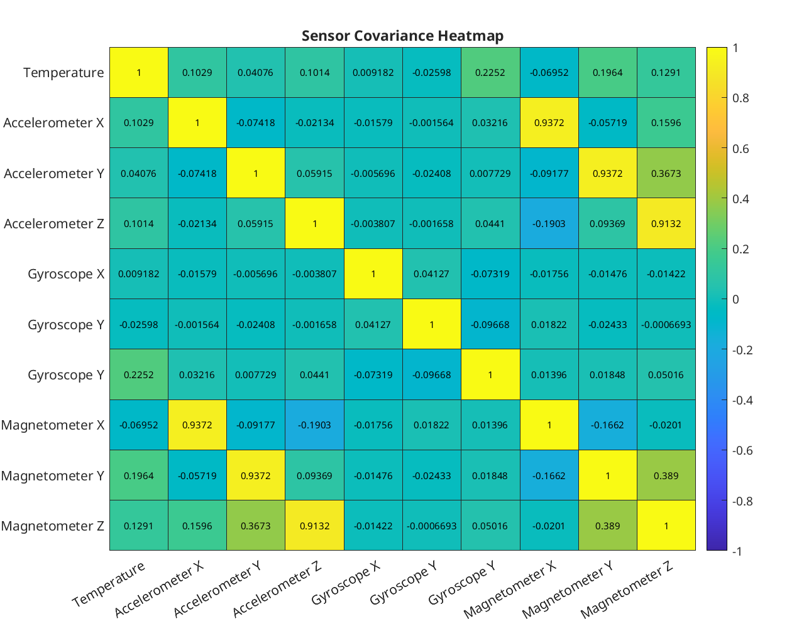

sensor data
===========

These are measurements of a **single rotation around z**, followed by **rotations around x** and **rotations around y** in local frame.

Starting from approximately 0° heading, the following sequence is given:

- **heading**: rotate around Z ~45° cw (**to heading ~45°**)
 - **roll**: rotate around X ~90° ccw, ~180° cw, ~90° ccw
 - **pitch**: tilt around Y ~90° cw, ~180° ccw, ~90° cw
- **heading**: rotate around Z ~45° cw (**to heading ~90°**)
 - **roll**: rotate around X ~90° ccw, ~180° cw, ~90° ccw
 - **pitch**: rotate around Y ~90° cw, ~180° ccw, ~90° cw
- **heading**: rotate around Z~ 90 ccw (**back to heading ~0°**)

The system is changed from approximately 0° heading to ~45°, rolled 90° ccw, 180° cw, 90° ccw around x, then tiltet  

    Z = fix, up
    |
    |  Y = fix/tilt, left
    | /
    |/______X = roll/fix, forward

### InvenSense MPU6050 ###

- Accelerometer
- Gyroscope
- Temperature

#### Speed ####

- measured at 100Hz

### Honeywell HMC5883L ###

- Magnetometer

#### Speed ####

- measured at 75Hz

## Data Overview

### Data exports

The raw data is available in CSV and Parquet formats:

- [`mpu6050.csv`](mpu6050.csv) and [`mpu6050.parquet`](mpu6050.parquet)
- [`hmc5833l.csv`](mpu6050.csv) and [`hmc5833l.parquet`](mpu6050.parquet)

### Sensor Readings

See [`sensor-stats.csv`](sensor-stats.csv) for summary statistics in tabular form. Below is a visualization of the sensor readings:

See also [`sensor-readings-fine.png`](sensor-readings-fine.png).

### Sensor Covariances

See [`sensor-covariances.csv`](sensor-covariances.csv) for the covariance matrix in tabular form. Below is a visualization as a heatmap:

