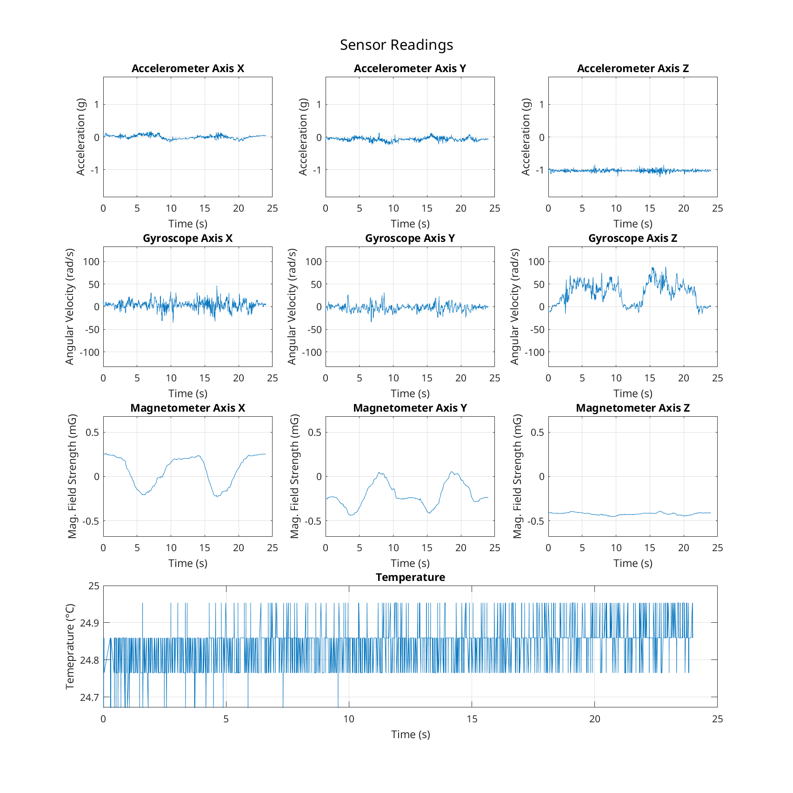

sensor data
===========

These are measurements of a two **counter-clockwise 360° rotations around the z axis** with the **z axis pointing up**.

    Z = fix, up
    |
    |  Y (left)
    | /
    |/______X (forward)

### InvenSense MPU6050 ###

- Accelerometer
- Gyroscope
- Temperature

#### Speed ####

- measured at 100Hz

### Honeywell HMC5883L ###

- Magnetometer

#### Speed ####

- measured at 75Hz

## Data Overview

### Data exports

The raw data is available in CSV and Parquet formats:

- [`mpu6050.csv`](mpu6050.csv) and [`mpu6050.parquet`](mpu6050.parquet)
- [`hmc5833l.csv`](mpu6050.csv) and [`hmc5833l.parquet`](mpu6050.parquet)

### Sensor Readings

See [`sensor-stats.csv`](sensor-stats.csv) for summary statistics in tabular form. Below is a visualization of the sensor readings:

See also [`sensor-readings-fine.png`](sensor-readings-fine.png).

### Sensor Covariances

See [`sensor-covariances.csv`](sensor-covariances.csv) for the covariance matrix in tabular form. Below is a visualization as a heatmap:

