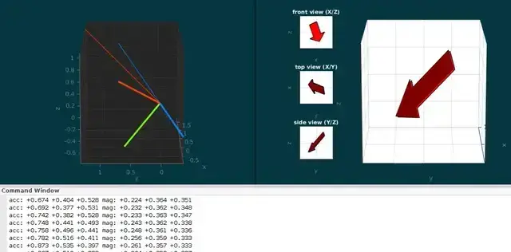

# InvenSense MPU6050 + Honeywell HMC5883L

See [set-1 description](../../data/set-1/README.md) for detailed information
about the data set.



To run the simulation, execute

```matlab
simulateOrientation
```

