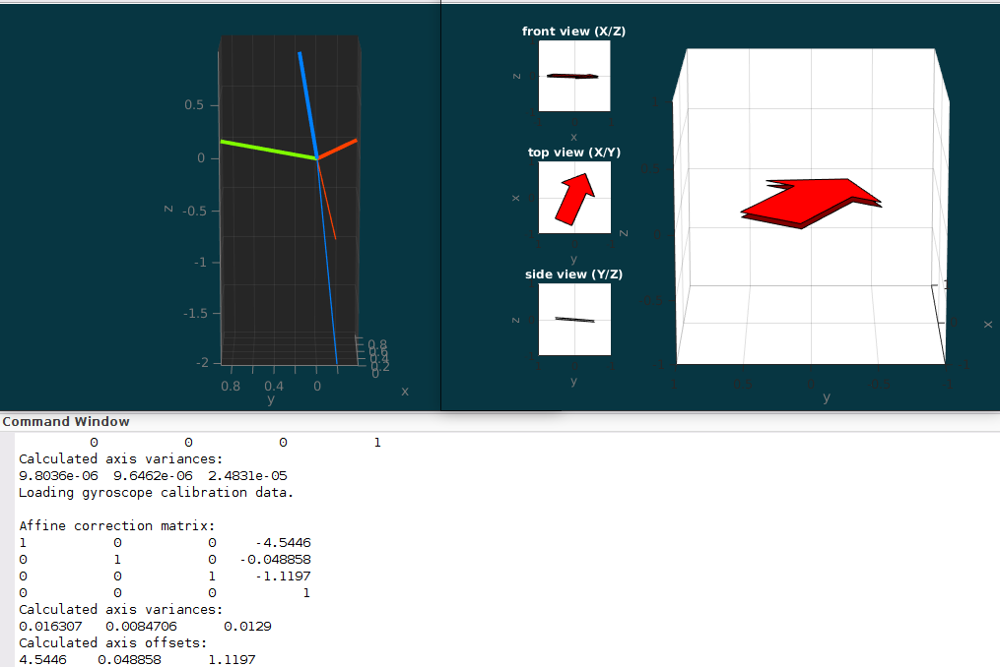

# InvenSense MPU6050 + Honeywell HMC5883L

See [set-2 description](../../data/set-2/README.md) for detailed information
about the data set.

To run the simulation, execute

```matlab
simulateOrientationFiltered
```


